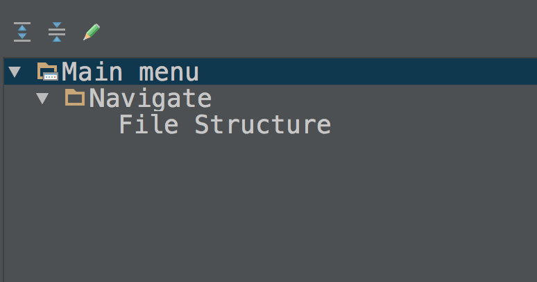

# Android Studio快捷键

参考：[快捷键高阶](http://blog.csdn.net/xinlvmylife/article/details/50695555)

1.代码浏览很好用，此快捷键可以调出当前文件的大纲，并通过模糊匹配快速跳转至指定的方法。。在公司mac上是 com+o，其他在keymap上按下图搜

2.代码提炼方法，Cmd + Option + M keymap搜 Extract Method

