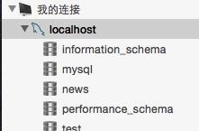
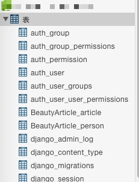

# 本地搭建下PyCharm+MySql+Django环境

虚拟主机代码调试不方便，修改ftp上传太慢。不利于本阶段（入门）的学习，效率低。

特此文字记录备后查看（文章逻辑得空再整理）。（系统为mac）

## Django部分略，通过PyCharm新建
*注意python构建版本*

## MySql连接部分
MySql本机已经通过homebrew装过
参考[mysql-python-install-mac](http://stackoverflow.com/questions/38549431/mysql-python-install-mac)
通过`pip install mysql-python`安装ptyhon mysql链接库。
途中遇到了点小问题。尝试
`easy_install MySQL-python --upgrade`
折腾无果，放弃次方法。

尝试`pip install pymysql` 本机没文件权限执行了：`sudo pip install pymysql`
参考了下面文章。
[http://www.jianshu.com/p/3f1820f3d904](http://www.jianshu.com/p/3f1820f3d904)
[http://www.bkjia.com/Pythonjc/1160073.html](http://www.bkjia.com/Pythonjc/1160073.html)

数据库工具 `Navicat Premium` 以下简称`NP`
`mysql.server start` 启动

NP连接可视化操作

至此本地数据库准备部分完成，下面折腾下Django本机数据库连接，最后尝试下，本地服务器数据库、配置自动切换（[参考](http://blog.csdn.net/twilight041132/article/details/50574221)）。
[官方文档](https://docs.djangoproject.com/en/1.10/topics/db/multi-db/)上面说配置第一个无效会自动连接第二个，没用上文的方法了，测试过可以自动切换。

## Django操作数据库
到项目目录执行如下命令同步所有的数据表（更多数据库命令需要进一步了解）
`python manage.py makemigrations`

`python manage.py migrate`

执行成功创建如下表，要自行建立model

Django提供后台操作，推荐自强学堂文章[点击查看](http://www.ziqiangxuetang.com/django/django-admin.html)

