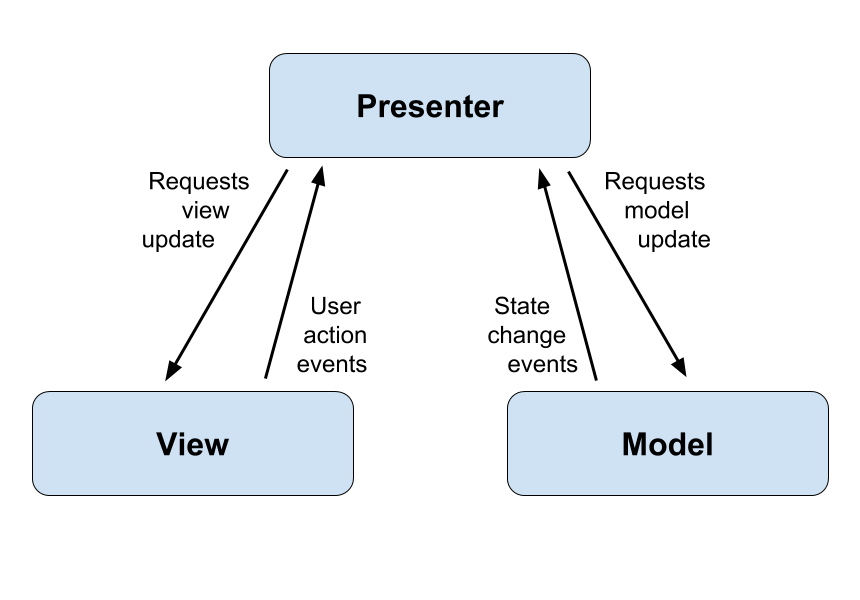
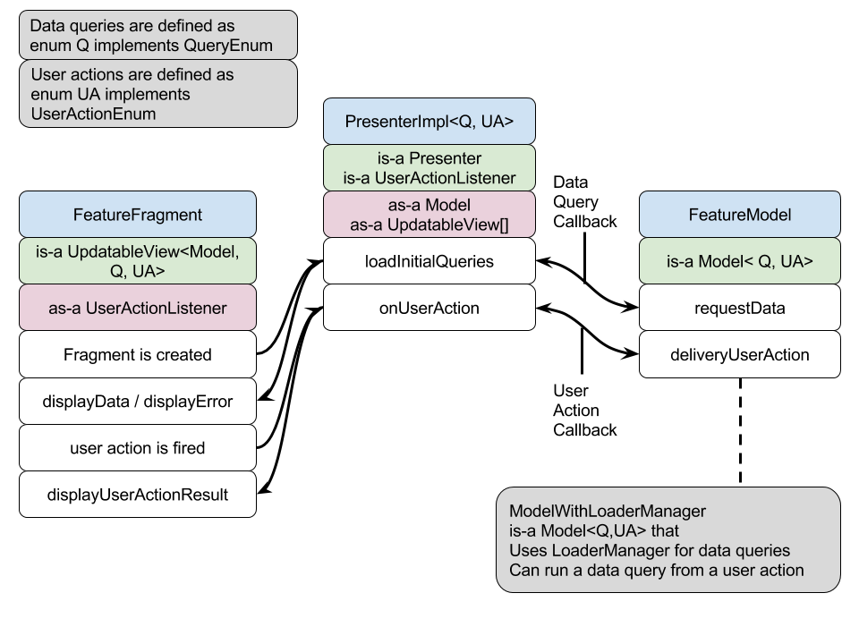

# 谷歌 iosched MVP_FRAMEWORK翻译

文末是全部原文，链接：https://github.com/google/iosched/blob/master/doc/MVP_FRAMEWORK.md
谷歌前几天更新了iosched的源码，是不错的学习素材。
水平有限，借助工具翻译，调了个别句子跟排版，凑合着看，有精力看源码有更好的理解再调整。

#什么是MVP ?
MVP（ModelViewPresenter）是一种关注分离解耦的软件架构。presenter充当模型和视图之间的桥梁，负责处理表示逻辑。

#为什么使用MVP
MVP架构提高了代码的可测试性、可读性和可伸缩性。这些改进是通过分离关注点来实现的:它支持更容易的测试(包括单元和UI)，更小的类大小，这样可以更容易地改变获取数据的方式或UI。

#我们如何实现MVP
+ **`DataQuery` 与 `UserAction` 概念的抽象**:
 `DataQuery`对应于上面的MVP图中的请求模型更新，`UserAction`对应于用户操作事件。抽象已经使用了接口[QueryEnum][QE] 和 [UserActionEnum][UAE]来完成。

 + A*UserAction*发生在视图中，由Presenter监听，并被发送到Model;Model处理与操作相关的任何数据更改，然后通过回调通知Presenter，它自己通知视图（View）

+ A *DataQuery*发生在数据查询。presenter创建了一个初始数据查询列表，该列表是在模型（Model）上请求的;模型（Model）运行查询，然后通过回调通知presenter，它本身通知视图（View）。

+ **[Model][M]，[View][V]和[presenter][P]**:这些都是用泛型进行的，所以从代码中可以清楚地看到，所有的类集成在一起构成一个特性。注意:由于view是Android中的一个类，因此mvp框架使用名称`UpdatableView`
+ **对于presenter的单一实现类**:通过使用上面的 *Query*和*UserAction*，所有特性都可以为presenter使用相同的实现类([PresenterImpl][PI])，从而减少新特性所需的新类的数量。PresenterImpl可能有一个或多个视图

+ **使用加载器管理器回调Model的抽象实现类**:我们的大部分功能都使用一个内容提供程序和加载器管理器来获取数据，因此我们创建了一个抽象实现类，名为[ModelWithLoaderManager][MLM]。需要关注加载器管理器实现细节。通过隐藏这个内部的模型（model）,而不是直接实现Fragment或Activity,这意味着我们若是改变这一切,我们只需要改变的模型（Model）类功能,不需要改变Fragment(UpdatableView)或Presenter

+ **框架实现类是单元测试**:PresenterImpl和加载器管理器模型（ModelWithLoaderManager）的具体方法是[单元][测试][MLMT]，所以不需要特殊的特性

+ **使用注解来加载模型特性**:[ModelProvider][MP]允许注入存根模型，从而使我们能够编写确定性的UI测试。
+ 

# 为新特性编写代码
+ 创建一个***FeatureActivity***类，以及至少一个 ***FeatureFragment*** 类。所有*FeatureFragment*类都应该实现[Updatable View][V]。
+ 创建一个***FeatureModel*** 类。是否使用加载器管理器（LoaderManager）获取数据?如果是，扩展[模型与加载器管理器（ModelWithLoaderManager）][MLM]。如果不是，就直接实现[模型（Model）][M]接口(参考[MyScheduleModel][MSM])。
+ 定义***数据查询（data queries）*** （在*FeatureModel* 类中）实现[QueryEnum][QE]的public*enum* （枚举）
+ 将***user actions*** (用户操作)定义为在Feature Model类中实现[UserActionEnum][UAE]的公开枚举

+ 创建**[PresenterImpl][PI]**的实例。您的活动中有多个片段实例吗?如果是，请使用片段管理器从您的特性活动中使用片段管理器实例化演示器Impl，以获得对所有特性片段实例的引用;如果不是，则直接从特征片段的单一视图构造函数实例化它。

+ **为您的模型应用TDD**: :创建一个单元测试类，为每个查询和用户操作编写测试。[PresenterImpl][PI]确保[模型][M]不能用无效的查询或用户操作来调用，因此不需要对它们进行测试。如果需要帮助，请参阅[SessionDetailModelTest][SDMT]。
+ 对您的视图应用TDD:单元测试对于复杂的类和方法是有用的，确保应用程序的唯一方法是，从用户的视图(UI测试)中对功能进行测试。
* 创建一个Android测试类。如果需要帮助，请参考[ExploreIOActivityTest][EIOAT]作为示例。
* 创建一个存根模型，它扩展了您的特性模型，并覆盖了查询内容提供程序的任何机制。引用[StubExploreIOModel][SEIOM]为例。
* 创建虚假数据或使用已经创建的假数据(参见[mockdata package][MDP]中的类)。要创建新的虚假数据，您可以在[OutputMockData]中找到有用的方法。此步骤是最耗时的步骤，但它确保您具有确定性的UI测试(即不依赖于服务器数据的测试)。
* 创建虚假数据或使用已经创建的假数据(参见[mockdata package][MDP]中的类)。要创建新的虚假数据，您可以在[输出模拟数据]中找到有用的方法。此步骤是最耗时的步骤，但它确保您具有确定性的UI测试(即不依赖于服务器数据的测试)。
* 使用[Android Test Support Library][ATSL]编写UI测试。参考[SessionFeedbackActivityTest][AFAT]和[SessionDetailActivity_InScheduleSessionTest][SDAT]作为一个例子。
* 注意，每个测试类使用相同的存根模型和相同的模拟数据，因此如果需要对不同的数据进行测试，那么创建几个测试类。

-------

# What is MVP?

ModelViewPresenter is a software architecture that separates concerns. The presenter acts as the 
bridge between the model and view, taking care of the presentation logic.

        

# Why MVP?

The MVP architecture improves testability, readability and scalability of the code. Those 
improvements are achieved by separating concerns: it enables easier testing (both unit and UI), 
smaller class sizes, and it makes it easier to change the way the data is obtained or the UI. 

# How we have implemented MVP

The main features of our mvp framework are:

+ **Abstraction of *DataQuery* and *UserAction* concepts**: *DataQuery* corresponds to *Requests 
model update* in the MVP diagram above, and *UserAction* corresponds to *User action events*. The 
abstraction has been done using an interface for each, [QueryEnum][QE] and [UserActionEnum][UAE].
    + A *UserAction* happens in a view, is listened to by the Presenter, and is dispatched to the 
    Model; the Model processes any data change related to the action, then, via a callback, notifies 
    the Presenter which itself notifies the view. 
    + A *DataQuery* happens when the view is loaded. The presenter is created with a list of initial
     *DataQuery*s, which are requested on the Model; the Model runs the queries, then, via a 
     callback, notifies the Presenter which itself notifies the view.

+ **Interfaces for [Model][M], [View][V] and [Presenter][P]**: those are typed using generics, so it's clear from 
the code what are all the classes integrating together to form a feature. Note: as View is a class 
in Android, the name UpdatableView is used for our mvp framework.

+ **Single implementation class for Presenter**: by using the abstraction above for *Query* and 
*UserAction*, all features can use the same implementation class for the Presenter 
([PresenterImpl][PI]), thus reducing the number of new classes required for new features. 
A PresenterImpl may have one or more Views.

+ **Abstract implementation class for Model using LoaderManager callbacks**: most of our features 
use a Content Provider and LoaderManager with a CursorLoader to get the data, so we have created 
an abstract implementation class called [ModelWithLoaderManager][MLM]. This takes care of the LoaderManager
 implementation detail. By hiding this inside the model, rather than implementing the LoaderManager
 directly on the Fragment or Activity, it means that should we decide to change this, we would need 
 only change the Model class for our features, with no change required in the Fragment 
 (UpdatableView) or Presenter.
 
+ **Framework implementation classes are unit tested**: PresenterImpl and concrete methods in 
ModelWithLoaderManager are [unit][PIT] [tested][MLMT], so individual features do not need to.

+ **Features use injection to load their model**: The [ModelProvider][MP] allows for stub models to be 
injected, thus enabling us to write deterministic UI tests. 

[QE]: ../android/src/main/java/com/google/samples/apps/iosched/archframework/QueryEnum.java
[UAE]: ../android/src/main/java/com/google/samples/apps/iosched/archframework/UserActionEnum.java
[M]: ../android/src/main/java/com/google/samples/apps/iosched/archframework/Model.java
[V]: ../android/src/main/java/com/google/samples/apps/iosched/archframework/UpdatableView.java
[P]: ../android/src/main/java/com/google/samples/apps/iosched/archframework/Presenter.java
[PI]: ../android/src/main/java/com/google/samples/apps/iosched/archframework/PresenterImpl.java
[MLM]: ../android/src/main/java/com/google/samples/apps/iosched/archframework/ModelWithLoaderManager.java
[PIT]: ../android/src/test/java/com/google/samples/apps/iosched/archframework/PresenterImplTest.java
[MLMT]: ../android/src/test/java/com/google/samples/apps/iosched/archframework/ModelWithLoaderManagerImplTest.java
[MP]: ../android/src/main/java/com/google/samples/apps/iosched/injection/ModelProvider.java

# Required coding for a new feature

+ Create a ***FeatureActivity*** class, and at least one ***FeatureFragment*** class. All 
*FeatureFragment* classes should implement [UpdatableView][V].

+ Create a ***FeatureModel*** class. Do you use LoaderManager to get the data? If yes, extend 
[ModelWithLoaderManager][MLM]. If not, implement the [Model][M] interface directly (refer to 
[MyScheduleModel][MSM] for an example).

+ Define the ***data queries*** as a public *enum* that implements [QueryEnum][QE], inside the 
*FeatureModel* class

+ Define the ***user actions*** as a public *enum* that implements [UserActionEnum][UAE], inside the 
*FeatureModel* class

+ Create an instance of the **[PresenterImpl][PI]**. Do you have multiple fragment instances in your 
activity? If yes, instantiate the *PresenterImpl* with the multiple views constructor from  your 
*FeatureActivity*, using the *FragmentManager* to get references to all your *FeatureFragment* 
instances; if not, instantiate it with the single view constructor from the *FeatureFragment* 
directly.

+ **Apply TDD for your model**: create a unit test class, write tests for each query and user 
action. The [PresenterImpl][PI] ensures that the [Model][M] cannot be called with invalid query or user
action so no need to test for those. Refer to [SessionDetailModelTest][SDMT] as an example if you need 
help to get started.

+ **Apply TDD for your view**: While unit tests are useful for complex classes and methods, the only 
way to ensure an app is maintainable is to have tests for the functionality from a user's point of view,
 ie UI tests. 
    * Create an Android test class. Refer to [ExploreIOActivityTest][EIOAT] as an example if you need 
    help to get started.
    * Create a stub model that extends your *FeatureModel* and override any mechanism that queries
    the content provider for data. Refer to [StubExploreIOModel][SEIOM] as an example.
    * Create fake data or use already created fake data (refer to classes in [mockdata package][MDP]).
     To create new fake data, you may find methods in  [OutputMockData][OMD] useful. This step is the
     most time consuming but it ensures you have deterministic UI tests (ie tests that don't rely on 
     the server data).
    * Write UI tests using the [Android Test Support Library][ATSL]. Refer to [SessionFeedbackActivityTest][AFAT]
    and [SessionDetailActivity_InScheduleSessionTest][SDAT] as an example.
    * Note that each test class will use the same stub model with the same mock data, so create 
    several test classes if you need tests for different data.

[MSM]: ../android/src/main/java/com/google/samples/apps/iosched/myschedule/MyScheduleModel.java
[SDMT]: ../android/src/test/java/com/google/samples/apps/iosched/session/SessionDetailModelTest.java
[EIOAT]: ../android/src/androidTest/java/com/google/samples/apps/iosched/explore/ExploreIOActivityTest.java
[SEIOM]: ../android/src/androidTest/java/com/google/samples/apps/iosched/explore/StubExploreIOModel.java
[MDP]: ../android/src/androidTest/java/com/google/samples/apps/iosched/mockdata/
[ATSL]: https://google.github.io/android-testing-support-library/
[OMD]: ../android/src/main/java/com/google/samples/apps/iosched/debug/OutputMockData.java
[AFAT]: ../android/src/androidTest/java/com/google/samples/apps/iosched/feedback/SessionFeedbackActivityTest.java
[SDAT]: ../android/src/androidTest/java/com/google/samples/apps/iosched/session/SessionDetailActivity_InScheduleSessionTest.java

